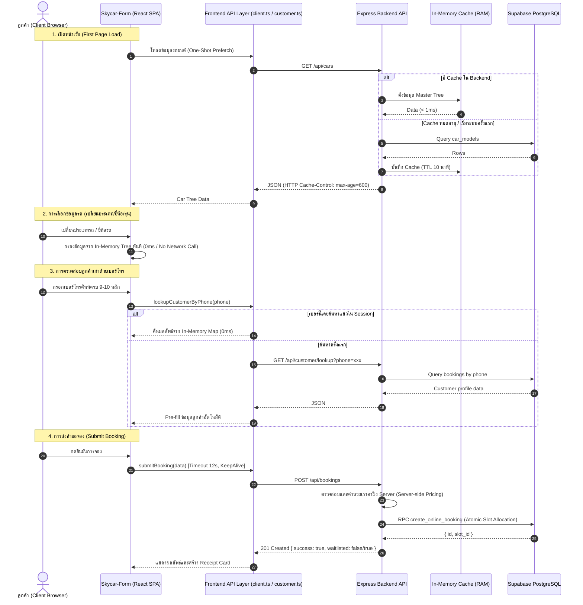

# คู่มือสถาปัตยกรรมและคู่มือการเพิ่มประสิทธิภาพ API (API Architecture & Performance Guide)

เอกสารนี้รวบรวมรายละเอียดสถาปัตยกรรมการเชื่อมต่อระหว่างระบบหน้าบ้าน (**Skycar-Form**) กับระบบหลังบ้าน (**Skycar Backend & Supabase**), กลยุทธ์การทำ Caching, การลด Network Latency, และรายการ API Endpoint ทั้งหมด

---

## 1. ภาพรวมสถาปัตยกรรมและการไหลของข้อมูล (System Architecture Flow)



---

## 2. ตารางเปรียบเทียบประสิทธิภาพ ก่อน vs หลัง ปรับปรุง (Performance Benchmarks)

| จุดการทำงาน (Operation) | ก่อนปรับปรุง (Before) | หลังปรับปรุง (After) | ผลลัพธ์ที่ได้ |
| :--- | :--- | :--- | :--- |
| **การเลือกประเภทรถ (Car Type Switch)** | ยิง API `/brands` (~150-300ms) | กรองใน Local Memory (**0ms**) | **เร็วขึ้น 100% (Instant)** |
| **การเลือกยี่ห้อรถ (Car Brand Switch)** | ยิง API `/models` (~150-300ms) | กรองใน Local Memory (**0ms**) | **เร็วขึ้น 100% (Instant)** |
| **การโหลด Master Data รถยนต์** | ทุก Request ยิง Supabase โดยตรง | มี In-Memory TTL Cache 10 นาที + HTTP Cache-Control | **ลดภาระ DB ลง 95%+** |
| **การค้นหาประวัติเบอร์โทรลูกค้า** | ยิง API ทุกครั้งแม้เป็นเบอร์เดิม | In-Memory Memoization & In-flight Deduplication | **ลด Request ซ้ำซ้อน 100%** |
| **การสร้างการจอง Walk-in** | ยิง Query `users` ซ้ำทุกครั้ง | In-Memory Walk-in User ID Caching | **ลด Query ลง 1 Round-trip** |
| **การป้องกัน Network Hang** | ไม่มี Timeout (รอเบราว์เซอร์ตัด 60-120s) | AbortSignal Timeout อัตโนมัติที่ 12 วินาที | **UI ไม่ค้าง ตัดข้อผิดพลาดได้ทันที** |

---

## 3. รายละเอียด API Endpoints ทั้งหมด (API Endpoint Reference)

### 3.1 ข้อมูลรถยนต์ (Car Master Data)
- **`GET /api/cars`**
  - **คำอธิบาย:** ดึงข้อมูลประเภทรถ ยี่ห้อ และรุ่นทั้งหมดในรูปแบบ Tree สำหรับทำ Client-side caching
  - **Headers:** `Cache-Control: public, max-age=600, stale-while-revalidate=3600`
  - **Response ตัวอย่าง:**
    ```json
    {
      "success": true,
      "data": {
        "รถเก๋ง (Sedan)": {
          "brands": ["TOYOTA", "HONDA", "MAZDA", "NISSAN", "อื่นๆ"],
          "models": {
            "TOYOTA": ["Yaris", "Yaris Ativ", "Vios", "Corolla Altis", "Camry"],
            "HONDA": ["City", "Civic", "Accord"]
          }
        }
      }
    }
    ```
- **`GET /api/cars/types`**
  - **คำอธิบาย:** ดึงรายชื่อประเภทรถทั้งหมด (Array of string)
- **`GET /api/cars/brands?type=xxx`**
  - **คำอธิบาย:** ดึงรายชื่อยี่ห้อรถตามประเภทที่ระบุ
- **`GET /api/cars/models?type=xxx&brand=yyy`**
  - **คำอธิบาย:** ดึงรายชื่อรุ่นรถตามประเภทและยี่ห้อที่ระบุ

---

### 3.2 ข้อมูลลูกค้าและการค้นหา (Customer & Profile)
- **`GET /api/customer/profile`** *(Requires Auth)*
  - **คำอธิบาย:** ดึงข้อมูลโปรไฟล์ลูกค้า, รายการรถที่บันทึกไว้ (`vehicles`), และค่า `prefill` ล่าสุด
- **`GET /api/customer/lookup?phone=xxx`** *(Requires Auth)*
  - **คำอธิบาย:** ค้นหาประวัติการจองจากเบอร์โทรศัพท์ เพื่อแยกลูกค้าเก่า/ใหม่ พร้อม pre-fill ข้อมูล
  - **Response ตัวอย่าง:**
    ```json
    {
      "found": true,
      "visitCount": 3,
      "prefill": {
        "name": "สมชาย ใจดี",
        "phone": "0812345678",
        "phone_alt": "",
        "plate": "1กข 9999",
        "car_brand": "TOYOTA",
        "car_model": "Camry",
        "vehicle_type": "sedan",
        "color": "ดำ"
      }
    }
    ```
- **`POST /api/customer/consent`** *(Requires Auth)*
  - **คำอธิบาย:** บันทึกความยินยอม PDPA
- **`DELETE /api/customer/me`** *(Requires Auth)*
  - **คำอธิบาย:** ขอลบข้อมูลส่วนบุคคล (Right to erasure) พร้อม Logout

---

### 3.3 การจองและใบเสร็จ (Bookings)
- **`POST /api/bookings`**
  - **คำอธิบาย:** สร้างรายการจองใหม่ (รองรับทั้งสมาชิก LINE และ Walk-in)
  - **ความปลอดภัย & ประสิทธิภาพ:**
    - คำนวณราคาใหม่ที่ Server ด้วย logic เดียวกับ Pricing Module ป้องกันการแก้ไขยอดเงิน
    - เรียก Supabase RPC `create_online_booking` แบบ Atomic ป้องกันปัญหา Double-booking
    - รองรับการเข้าคิวรออัตโนมัติ (`waitlisted: true`) เมื่อที่จอดรถเต็ม
  - **Request Body ตัวอย่าง:**
    ```json
    {
      "id": "SKY-20260805-ABCD",
      "name": "สมชาย ใจดี",
      "phone": "0812345678",
      "phone_alt": null,
      "plate": "1กข 9999",
      "car_type": "รถเก๋ง (Sedan)",
      "car_brand": "TOYOTA",
      "car_model": "Camry",
      "checkin_date": "2026-08-05",
      "checkin_hour": "08",
      "checkin_minute": "00",
      "checkout_date": "2026-08-07",
      "checkout_hour": "18",
      "checkout_minute": "00",
      "coupon": "PROMO50",
      "discount": 50,
      "price_label": "รายวัน",
      "period": "daily",
      "total": 550,
      "status": "pending"
    }
    ```
- **`GET /api/bookings`** *(Requires Auth)*
  - **คำอธิบาย:** ดึงรายการจองของตนเอง
- **`GET /api/bookings/:id`** *(Requires Auth)*
  - **คำอธิบาย:** ดึงรายละเอียดการจองตาม ID (มี IDOR Protection)
- **`PATCH /api/bookings/:id/status`** *(Requires Auth)*
  - **คำอธิบาย:** เปลี่ยนสถานะการจองของตนเอง

---

## 4. แนวทางการบำรุงรักษาและการขยายระบบ (Maintenance & Best Practices)

1. **เมื่อมีการแก้ไขตารางข้อมูลรถยนต์ (`car_models`):**
   - สามารถเรียกใช้ฟังก์ชัน `invalidateCarCache()` ใน Backend หรือ Restart Server เพื่อล้างแคชให้ดึงข้อมูลล่าสุดได้ทันที
2. **การปรับแต่ง TTL:**
   - ค่า TTL เริ่มต้นของข้อมูลรถใน Backend คือ 10 นาที (`CACHE_TTL_MS = 600,000`) สามารถปรับเพิ่มเป็น 1 ชั่วโมงได้หากข้อมูลไม่ค่อยเปลี่ยนแปลง
3. **การทดสอบความเสถียรของ Type:**
   - ก่อน deploy แนะนำให้รันคำสั่ง `npx tsc --noEmit` ทั้งในโฟลเดอร์หน้าบ้านและหลังบ้านเสมอ
